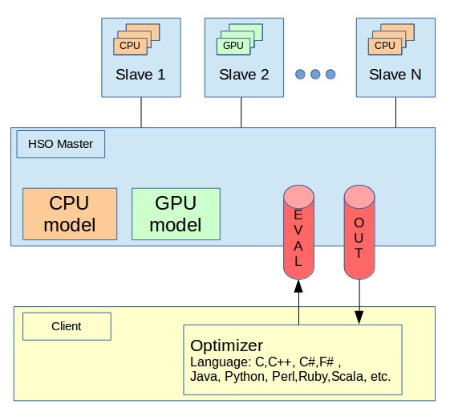
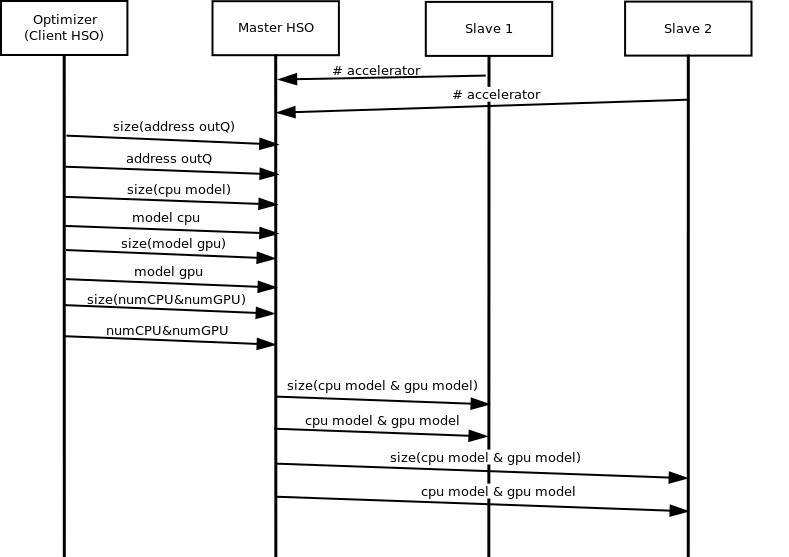
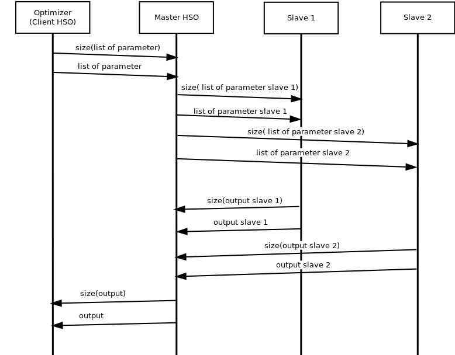

# Heterogeneous Simulation Optimization (HSO)

The simulations are used to model and analyze complex behaviors. These behaviors are translated into a mathematical model governed by a set of parameters.  
Usually, we want find some parameters that make the solution of the model admissible and close to the best.
Simulation optimization is the process of finding the best input variable values from among all possibilities without explicitly evaluating each possibility. This process aims to minimize the resources spent while maximizing the information obtained in a simulation experiment.


**Heterogeneous Simulation Optimization (HSO)** is:

* Developed for Simulation Optimization.
* Written in C, and use the MPI Library.
* Made for Linux.

HSO supports the Heterogeneous Computing, that is exploit the available computational accelerators for run the simulations in the better way.

Another interesting feature of HSO is that you can use optimization function written in different programming language (C, C++, C#, Python, Java, etc.) using the [ZeroMQ](http://www.zeromq.org/) Library.

## HSO structure




The figure illustrates the main components of **HSO**. We can see that the Optimizer is connected to the HSO master through two queues, which are essentially two ZeroMQ sockets.

The Optimizer is unaware that the master HSO exploits the computational power of multiple nodes.

The strings sent on the two ZeroMQ sockets can be of three types:

* Control strings, used to set the simulation execution environment.
* Strings containing the list of parameters to run the simulations.
* Strings containing the result of the simulations.

> The first two types of string are sent on the EVAL socket from the Optimization function to the HSO Master, while the last type is sent on the OUT socket form the HSO Master to the optimization function

### HSO workflow

In the initialization phase, the coordinated execution between the HSO Master (and Slaves) and  the Optimizer follows this pattern:

1. When the HSO Master starts, it waits for the Slaves to send the number of CPUs or the number of Computational Accelerators available (for the moment we consider only the GPUs).
2. The Slave, at start, sent this information and wait for simulation model informations from the HSO Master.
3. The HSO Master waits for the Optimizer.
4. When the Optimizer starts, send to the HSO Master the address of OUT socket, the CPU model and the GPU model.
5. The HSO master sets the simulation execution environment, sends the information received to the Slaves, and waits the list of parameters from the Optimizer.
6. The Slave sets the CPU model and the GPU model and waits for the parameters of simulations from the HSO master.



After the initialization phase, the coordinated execution between the HSO Master (and Slaves) and  the Optimizer follows this pattern:

1. The Optimizer send the list of parameters to the HSO Master.
2. The Master HSO, received this list, prepare and send to each Slave a string containing the list of parameters that the Slave must perform. The Master HSO is waiting for the results;
3. The Slave, received the list of parameters, starts running the simulations. After finishing his simulations send the result to the HSO Master.
4. The HSO Master collects the slave's output, concatenates his, and sends everything to the Optimizer.
5. The Optimizer, received the output, makes its own consideration and decides whether to terminate or send a new parameter list.
6. After finishing the computation for an Optimizer, the HSO Master waits for a new Optimizer, and the process just described will start again.



## HSO installation and usage

Before installing make sure you have the following requirements:

* autoreconf 2.69 or higher
* MPI
* ZeroMQ, for installation guide see [ZeroMQ - Get the software](http://zeromq.org/intro:get-the-software)

To install HSO:

1. Download the HSO github repository
```
    git clone https://github.com/isislab-unisa/hso.git
```

2. Install HSO:
```
    cd "path to HSO folder"  
    chmod +x autogen.sh  
    ./autogen.sh  
    ./configure   
    make  
```
3. To run HSO:
```
    cd "path to HSO folder"
    mpirun -np numTask -host listHosts hso  
```

Note that:

* path to HSO folder, is the folder where you want to install HSO;
* numTask, is the number of processes to invoke;
* listHosts, is the list of hosts on which to invoke proecesses.

For more details about the usage of HSO see the [Example: Zombie](./example/Zombie/README.md)
