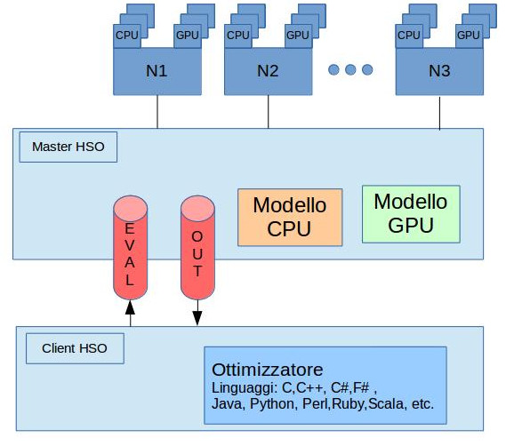

# Heterogeneous Simulation Optimization (HSO)

Le simulazioni vengono utilizzate per modellare ed analizzare dei comportamenti complessi, tali comportamenti si traducono in un modello matematico governato da un insieme parametri.
A seconda del valore che diamo a questi parametri il modello avrà una certa soluzione, solitamente quello che si vuole è trovare dei parametri che rendano la soluzione _ammissibile_ e quanto più vicina all'_ottimo_.

La tecnica di Simulation Optimizzation ci permette di trovare questi parametri migliori senza esplorare tutto lo spazio dei parametri, ed ha come scopo quello di andare a minimizzare l'utilizzo delle risorse spese andando a massimizzare le informazioni ricavate dalle simulazioni.

**Heterogeneous Simulation Optimizzation (HSO)** è:

* Sviluppato per Simulation Optimizzation.
* Scritto in C.
* Piattforma supportata: Linux

HSO supporta l'Heterogeneous computing, cioè sfrutta gli accelleratori disponibili per poter eseguire le simulazioni in maniera efficiente.

Un'altra caratteristica interessante di HSO è quella di poter utilizzare funzioni di ottimizzazione scritte in diversi linguaggi di programmazione tra cui (Python, Java, etc) grazie all'utilizzo della libreria ZeroMQ. 

## Architettura HSO

La figura mostra i componenti fondamentali di **HSO**.

Il Master HSO non appena viene lanciato fa partire una fase di discovery delle risorse per trovare gli accelleratori disponibili. Una volta riecvute tali informazioni attende dei messaggi da parte della funzione di ottimizzazione.

Come si vede dall'immagine la funzione di ottimizzazione comunica con il master HSO attraverso due code (EVAL e OUT), che sono essenzialmente dei socket zeroMQ su cui vengono inviate delle stringhe. Tali stringhe possono essere:

* stringhe di controllo, usate per settare l'ambiente di esecuzione delle simulazioni 
* stringhe contenenti la lista dei parameti su cui eseguire le simulazioni
* stringhe contenti il risultato della computazione

>Le prime due tipologie di stringhe vengono inviate sul socket EVAL dalla funzione di ottimizzazione e utilizzate dal master HSO, mentre l'ultima tipologia di stringhe viene inviata sul socket OUT dal master HSO e utilizzata dalla funzione di ottimizzazione

Il master HSO dopo aver ricevuto dopo aver ricevuto le stringhe di controllo ed aver comunicato tali stringhe a tutti i suoi slave, attende la lista dei parametri su cui eseguire le simulazioni. Una volta ottenuta questa lista fa partire la computazione distribuendola sugli slave. Una volta terminata la computazione, il risultato di quest'ultima viene inviato alla funzione di ottimizzazione, che effettuerà le sue considerazioni sull'output ricevuto e a seconda di quest'ultime o terminerà o invierà al master HSO una nuova lista di parametri. 
