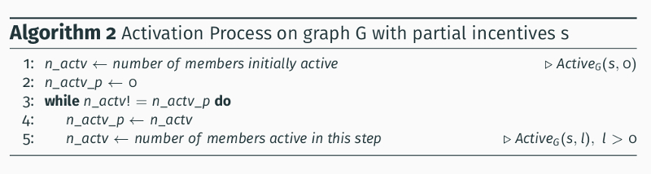
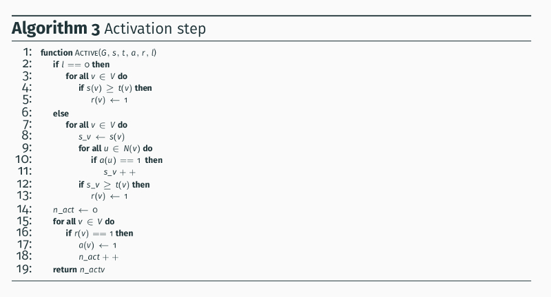

# Spread of Influence: simulation in C

This is a C implementation of the activation process on a graph.

The pseudocode of the activation process is the follow:



and the pseudocode of the activatio step in the follow:



The implementation uses the library [igraphc](http://igraph.org/c/) to manage the operations on the graphs.

## Simulation prerequisites

* gcc compiler
* igraphc

## How to run the simulation

To build the simulation:

```
    cd "path to .c file"
    gcc -o cpu_spread cpu_spread_eval.c $(pkg-config --libs --cflags igraph)
```
To run the simulation, the scpit cpu_script.sh:

```
    #!/bin/bash

    set -eu

    if [ $# -eq 0 ]
    then
        echo "No arguments supplied: run ./script.sh <params>"
        exit 1
        fi

        param_line=$1

        IFS='_'
        read -ra PARAMS <<< "$param_line"
        cd ../example/Spread_Influence/Simulation_Cpu
        ./cpu_spread ${PARAMS[0]} ${PARAMS[1]} ${PARAMS[2]}
```

The script take one argument, the string of parameters in this form "graph_s_T" where:

* graph, is the filepath of the graph;
* s, is the vector of partial incentives on the members;
* T, is the ammount of threshold used for the generation of the vector t of thresholds on the members.

An example of run is the follow:

```
    ./cpu_script graph.txt_0,1,2,3,0,...,2_350
```
