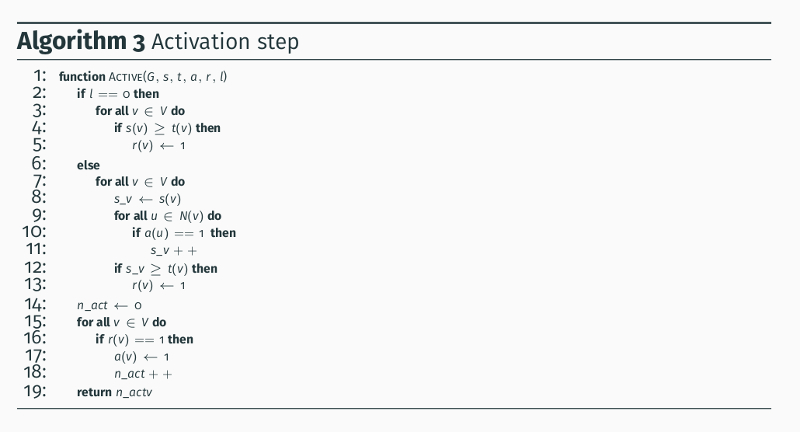

# Spread of Influence: simulation in CUDA C

This is a CUDA C implementation of the activation process on a graph.

The pseudocode of the activation process is the follow:


and the pseudocode of the activatio step in the follow:



The activation step implementation has been adapted to be able to run on the GPU


The function Active take the following arguments:

* s, the vector of incentives;
* t, the vector of thresholds;
* a, the activation vector of previous step;
* adj, the vector that represent the adjacency matrix of the graph;
* adj_index, an auxiliary vector;
* d_result, the activation vector of the step;
* num_v, the number of vertices in the graph;
* l, the number of the step.


## Simulation prerequisites

* CUDA Toolkit 7.5
* igraphc

## How to run the simulation

To build the simulation:

```
    cd "path to .c file"
    nvcc -o gpu_spread cuda_spread_eval.cu $(pkg-config --libs --cflags igraph)
```
To run the simulation, the scpit gpu_script.sh:

```
    #!/bin/bash

    set -eu

    if [ $# -eq 0 ]
	   then
		     echo "No arguments supplied: run ./script.sh <params> <gpu_id>"
		     exit 1
    fi

    param_line=$1   
    GPUID=$2
    IFS='_'
    read -ra PARAMS <<< "$param_line"
    cd ../example/Spread_Influence/Simulation_Gpu
    ./gpu_spread ${PARAMS[0]} ${PARAMS[1]} ${PARAMS[2]} $GPUID
```

The script take two argument.
The first the string of parameters in this form "graph_s_T" where:

* graph, is the filepath of the graph;
* s, is the vector of partial incentives on the members;
* T, is the ammount of threshold used for the generation of the vector t of thresholds on the members.

The second is used to decide which GPU to perform the simulation, and is thus a valid id of a GPU.

An example of run is the follow:

```
    ./cpu_script graph.txt_0,1,2,3,0,...,2_350 0
```
